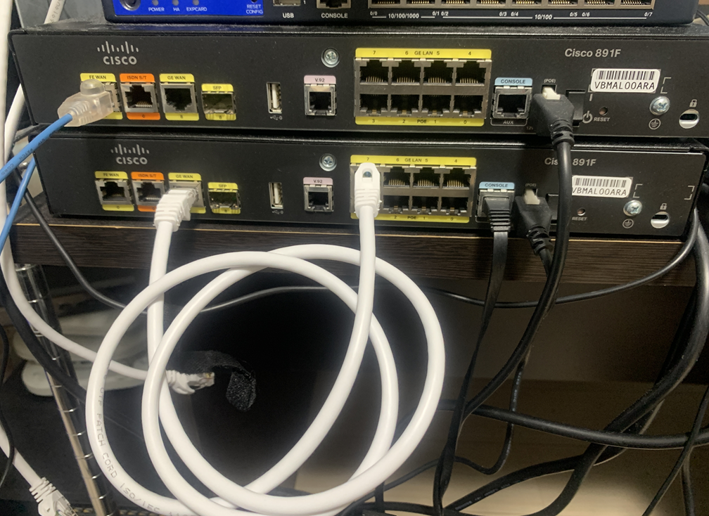

# Cisco 891 ルーターにおける ACL 検証

## 目次

<!-- @import "[TOC]" {cmd="toc" depthFrom=2 depthTo=6 orderedList=false} -->

<!-- code_chunk_output -->

- [目次](#目次)
- [はじめに](#はじめに)
- [検証構成](#検証構成)
  - [物理トポロジ](#物理トポロジ)
  - [論理トポロジ](#論理トポロジ)
  - [基本コンフィグ](#基本コンフィグ)
  - [疎通確認](#疎通確認)
- [検証1](#検証1)
  - [GE7 out 方向で telnet を止めてみる (失敗)](#ge7-out-方向で-telnet-を止めてみる-失敗)
    - [設定](#設定)
    - [結果](#結果)
  - [GE8 in 方向で telnet を止めてみる (成功)](#ge8-in-方向で-telnet-を止めてみる-成功)
    - [設定](#設定-1)
    - [結果](#結果-1)
  - [vlan 1 IF out 方向で telnet を止めてみる (失敗)](#vlan-1-if-out-方向で-telnet-を止めてみる-失敗)
    - [設定](#設定-2)
    - [結果](#結果-2)
  - [中間結果まとめ](#中間結果まとめ)
    - [SV→CL方向の遮断](#svcl方向の遮断)
  - [GE7 in 方向で telnet を止めてみる (成功)](#ge7-in-方向で-telnet-を止めてみる-成功)
    - [設定](#設定-3)
    - [結果](#結果-3)
    - [念のため再確認](#念のため再確認)
    - [(参考) Catalyst 9000 での仕様](#参考-catalyst-9000-での仕様)
  - [GE8 out 方向で telnet を止めてみる (失敗)](#ge8-out-方向で-telnet-を止めてみる-失敗)
    - [設定](#設定-4)
    - [結果](#結果-4)
  - [vlan 1 IF in 方向で telnet を止めてみる (成功)](#vlan-1-if-in-方向で-telnet-を止めてみる-成功)
    - [設定](#設定-5)
    - [結果](#結果-5)
  - [結果まとめ](#結果まとめ)
    - [SV→CL方向の遮断](#svcl方向の遮断-1)
    - [CL→SV方向の遮断](#clsv方向の遮断)
  - [考察](#考察)
- [検証2](#検証2)
  - [GE7 out 方向に存在しない ACL を指定すると疎通しないことを確認](#ge7-out-方向に存在しない-acl-を指定すると疎通しないことを確認)
    - [設定](#設定-6)
    - [結果](#結果-6)
  - [GE7 out 方向に deny any ACL を指定すると疎通しないことを確認](#ge7-out-方向に-deny-any-acl-を指定すると疎通しないことを確認)
    - [設定](#設定-7)
    - [結果](#結果-7)
  - [GE7 out 方向に permit any ACL を指定すると疎通することを確認](#ge7-out-方向に-permit-any-acl-を指定すると疎通することを確認)
    - [設定](#設定-8)
    - [結果](#結果-8)
  - [GE7 out 方向で deny any ACL が確かに効いていることを確認](#ge7-out-方向で-deny-any-acl-が確かに効いていることを確認)
    - [設定](#設定-9)
    - [結果](#結果-9)
  - [GE7 out 方向で permit icmp/tcp any ACL が効くことを確認](#ge7-out-方向で-permit-icmptcp-any-acl-が効くことを確認)
    - [設定](#設定-10)
    - [結果](#結果-10)
  - [GE7 out 方向でペイロード条件を指定した ACL を指定すると効かないことを確認](#ge7-out-方向でペイロード条件を指定した-acl-を指定すると効かないことを確認)
    - [設定](#設定-11)
    - [結果](#結果-11)
- [更新履歴](#更新履歴)

<!-- /code_chunk_output -->

## はじめに

C891 でいろいろ ACL を設定して遊んでいたのですが，一部想定通りに動作しない事象を経験しました．
原因がよくわからず気持ち悪いので，とりあえず順を追って切り分けをしていこうと思った次第です．

## 検証構成

### 物理トポロジ

手抜きで C891 1台でやっていきます．GE8 (routed port) と GE7 (switched port) を結線しています．VRF は分けています．


### 論理トポロジ

GE8 と VLAN Interface 1 が同セグで通信できるように IP アドレスを振っています．GE7 は vlan 1 のアクセスポートです．

```
GE8 ------------- GE7 ---- vlan 1 IF 
10.0.0.1/24              10.0.0.2/24
```

### 基本コンフィグ

IOS Version は 15.4(3)M3 です．

```
ip arp proxy disable
vtp mode transparent
no ip domain lookup

ip vrf vrf1
 rd 65001:1

enable algorithm-type scrypt secret cisco

interface GigabitEthernet 8
 ip address 10.0.0.1 255.255.255.0
 no shutdown

interface Vlan1
 ip vrf forwarding vrf1
 ip address 10.0.0.2 255.255.255.0
 no shutdown

interface GigabitEthernet 7
 switchport mode access
 switchport access vlan 1

line con 0
 logging synchronous
line vty 0 4
 password cisco
 login
 transport input telnet
```

### 疎通確認

```
Router#ping 10.0.0.2
Type escape sequence to abort.
Sending 5, 100-byte ICMP Echos to 10.0.0.2, timeout is 2 seconds:
!!!!!
Success rate is 100 percent (5/5), round-trip min/avg/max = 1/1/4 ms
Router#telnet 10.0.0.2
Trying 10.0.0.2 ... Open

User Access Verification

Password:
```

## 検証1

いろいろな ACL を設定してみて，ping と telnet が疎通するか確認していきます．

### GE7 out 方向で telnet を止めてみる (失敗)

#### 設定

下記のように ACL を設定し，10.0.0.1 → 10.0.0.2 telnet の戻り通信を落としてみます．

```
access-list 100 deny   tcp host 10.0.0.2 eq telnet any log-input
access-list 100 permit ip any any log-input

interface GigabitEthernet7
 ip access-group 100 out
```

#### 結果

```
Router#ping 10.0.0.2
Type escape sequence to abort.
Sending 5, 100-byte ICMP Echos to 10.0.0.2, timeout is 2 seconds:
!!!!!
Success rate is 100 percent (5/5), round-trip min/avg/max = 1/1/1 ms

Router#telnet 10.0.0.2
Trying 10.0.0.2 ... Open

User Access Verification

Password:
```

…なぜ telnet が通ってしまうのでしょうか．

```
Router#show access-lists
Extended IP access list 100
    10 deny tcp host 10.0.0.2 eq telnet any log-input
    20 permit ip any any log-input
```

ACL のカウンタは上がっていませんし，ログも出ません．効いていないように見えます．

### GE8 in 方向で telnet を止めてみる (成功)

そもそも ACL の設定方法があっているか不安なので一番安定な routed port で試してみます．

#### 設定

```
interface GigabitEthernet 7
 no ip access-group out

interface GigabitEthernet 8
 ip access-group 100 in
```

#### 結果

```
Router#ping 10.0.0.2
Type escape sequence to abort.
Sending 5, 100-byte ICMP Echos to 10.0.0.2, timeout is 2 seconds:
!!!!!
Success rate is 100 percent (5/5), round-trip min/avg/max = 1/2/4 ms

*Oct 13 04:22:01.582: %SEC-6-IPACCESSLOGDP: list 100 permitted icmp 10.0.0.2 (GigabitEthernet8 xxxx.xxxx.xxxx) -> 10.0.0.1 (0/0), 1 packet

Router#telnet 10.0.0.2
Trying 10.0.0.2 ...
*Oct 13 04:22:42.250: %SEC-6-IPACCESSLOGP: list 100 denied tcp 10.0.0.2(23) (GigabitEthernet8 xxxx.xxxx.xxxx) -> 10.0.0.1(48223), 1 packet

Router#show access-lists
Extended IP access list 100
    10 deny tcp host 10.0.0.2 eq telnet any log-input (4 matches)
    20 permit ip any any log-input (5 matches)
```

想定通りの動作になりました．ACLログも見えています．

### vlan 1 IF out 方向で telnet を止めてみる (失敗)

#### 設定

```
interface GigabitEthernet 8
 no ip access-group in

interface vlan 1
 ip access-group 100 out

clear access-list counters
```

#### 結果

```
Router#ping 10.0.0.2
Type escape sequence to abort.
Sending 5, 100-byte ICMP Echos to 10.0.0.2, timeout is 2 seconds:
!!!!!
Success rate is 100 percent (5/5), round-trip min/avg/max = 1/1/4 ms

Router#telnet 10.0.0.2
Trying 10.0.0.2 ... Open

User Access Verification

Password:

Router#show access-lists
Extended IP access list 100
    10 deny tcp host 10.0.0.2 eq telnet any log-input
    20 permit ip any any log-input
```

vlan interface でも効いていませんね．

### 中間結果まとめ

#### SV→CL方向の遮断

|I/F|I/F 種別|方向|ACLの有効性|ログ/カウンター|
|:---:|:---:|:---:|:---:|:---:|
|GE8|L3|in|〇|〇|
|GE7|L2|out|×|×|
|vlan 1|SVI|out|×|×|

SV→CL 通信制御の結果はこうなりました．次は CL→SV 通信の方で検証してみましょう．

### GE7 in 方向で telnet を止めてみる (成功)

#### 設定

```
interface vlan 1
 no ip access-group out

access-list 101 deny   tcp any host 10.0.0.2 eq telnet log-input
access-list 101 permit ip any any log-input

interface GigabitEthernet7
 ip access-group 101 in
```

#### 結果

```
Router#ping 10.0.0.2
Type escape sequence to abort.
Sending 5, 100-byte ICMP Echos to 10.0.0.2, timeout is 2 seconds:
!!!!!
Success rate is 100 percent (5/5), round-trip min/avg/max = 1/1/4 ms

Router#telnet 10.0.0.2
Trying 10.0.0.2 ...
% Connection timed out; remote host not responding

Router#telnet 10.0.0.2
Trying 10.0.0.2 ...
% Connection timed out; remote host not responding

Router#show access-lists
Extended IP access list 100
    10 deny tcp host 10.0.0.2 eq telnet any log-input
    20 permit ip any any log-input
Extended IP access list 101
    10 deny tcp any host 10.0.0.2 eq telnet log-input
    20 permit ip any any log-input
Router#
```

新しい事象です．ACL は効いているように見えますが，ログも出ずカウンタも上がりません．

#### 念のため再確認

ACL のせいで telnet が止まっていることを確認したいので，つけ外ししてもう1回確認します．

```
Router(config)#interface GigabitEthernet 7
Router(config-if)#no ip access-group in
Router(config-if)#exit
Router(config)#do telnet 10.0.0.2
Trying 10.0.0.2 ... Open

User Access Verification

Password:
Password:
Password:
% Bad passwords

[Connection to 10.0.0.2 closed by foreign host]

Router(config)#interface GigabitEthernet 7
Router(config-if)# ip access-group 101 in
Router(config-if)#exit
Router(config)#do telnet 10.0.0.2
Trying 10.0.0.2 ...
% Connection timed out; remote host not responding

Router#show access-lists
Extended IP access list 100
    10 deny tcp host 10.0.0.2 eq telnet any log-input
    20 permit ip any any log-input
Extended IP access list 101
    10 deny tcp any host 10.0.0.2 eq telnet log-input
    20 permit ip any any log-input
```

やはり ACL が効いていますね．

#### (参考) Catalyst 9000 での仕様

> - ACL ロギングは、SVI で使用するL3 インターフェース、もしくは、ルーテッドインターフェースのみでサポートされます
> - コントロールプレーンから生成されたパケットに対し、Egress 方向のACL ログはサポートしていません

[Catalyst 9000 ACL ロギング、統計情報について - Cisco Community](https://community.cisco.com/t5/tkb-%E3%83%8D%E3%83%83%E3%83%88%E3%83%AF%E3%83%BC%E3%82%AF%E3%82%A4%E3%83%B3%E3%83%95%E3%83%A9-%E3%83%89%E3%82%AD%E3%83%A5%E3%83%A1%E3%83%B3%E3%83%88/catalyst-9000-acl-%E3%83%AD%E3%82%AE%E3%83%B3%E3%82%B0-%E7%B5%B1%E8%A8%88%E6%83%85%E5%A0%B1%E3%81%AB%E3%81%A4%E3%81%84%E3%81%A6/ta-p/4659751)

機種は異なりますが，もし C891 でも同様の仕様だと仮定した場合，今回は switch port に設定された ACL のためにログが出なかった可能性がありますね．

### GE8 out 方向で telnet を止めてみる (失敗)

#### 設定

```
interface GigabitEthernet 7
 no ip access-group in

interface GigabitEthernet 8
 ip access-group 101 out

clear access-list counters
```

#### 結果

```
Router#ping 10.0.0.2
Type escape sequence to abort.
Sending 5, 100-byte ICMP Echos to 10.0.0.2, timeout is 2 seconds:
!!!!!
Success rate is 100 percent (5/5), round-trip min/avg/max = 1/1/4 ms

Router#telnet 10.0.0.2
Trying 10.0.0.2 ... Open

User Access Verification

Password:

Router#show access-lists
Extended IP access list 100
    10 deny tcp host 10.0.0.2 eq telnet any log-input
    20 permit ip any any log-input
Extended IP access list 101
    10 deny tcp any host 10.0.0.2 eq telnet log-input
    20 permit ip any any log-input
```

ACL は効いておらず，ログ/カウンターも上がりません．

### vlan 1 IF in 方向で telnet を止めてみる (成功)

#### 設定

```
interface GigabitEthernet 8
 no ip access-group out

interface vlan 1
 ip access-group 101 in

clear access-list counters
```

#### 結果

```
Router#ping 10.0.0.2
Type escape sequence to abort.
Sending 5, 100-byte ICMP Echos to 10.0.0.2, timeout is 2 seconds:
!!!!!
Success rate is 100 percent (5/5), round-trip min/avg/max = 1/2/4 ms
*Oct 15 11:02:51.305: %SEC-6-IPACCESSLOGDP: list 101 permitted icmp 10.0.0.1 (Vlan1 80e0.1d3a.af3c) -> 10.0.0.2 (8/0), 1 packet

Router#telnet 10.0.0.2
Trying 10.0.0.2 ...
% Destination unreachable; gateway or host down

*Oct 15 11:02:56.841: %SEC-6-IPACCESSLOGP: list 101 denied tcp 10.0.0.1(28542) (Vlan1 80e0.1d3a.af3c) -> 10.0.0.2(23), 1 packet

Router#show access-lists
Extended IP access list 100
    10 deny tcp host 10.0.0.2 eq telnet any log-input
    20 permit ip any any log-input
Extended IP access list 101
    10 deny tcp any host 10.0.0.2 eq telnet log-input (1 match)
    20 permit ip any any log-input (5 matches)
```

ACL は効いており，ログ/カウンターも上がっています！さらに面白いことに Destination unreachable が出ました．ICMP type 3 が返ったのでしょうか．

### 結果まとめ

#### SV→CL方向の遮断

|I/F|I/F 種別|方向|ACLの有効性|ログ/カウンター|備考|
|:---:|:---:|:---:|:---:|:---:|:---:|
|GE8|L3|in|〇|〇||
|GE7|L2|out|×|×||
|vlan 1|SVI|out|×|×||

#### CL→SV方向の遮断

|I/F|I/F 種別|方向|ACLの有効性|ログ/カウンター|備考|
|:---:|:---:|:---:|:---:|:---:|:---:|
|GE8|L3|out|×|×||
|GE7|L2|in|〇|×||
|vlan 1|SVI|in|〇|〇|timeout を待たずに dest unreach|

### 考察

- in 方向 ACL は安定して有効
- L2 I/F に in 方向で ACL をかけるとログが出ない
- out 方向 ACL はまったく効かない

out 方向で効かない理由がわかりませんね．Copilot に聞くと下記のように回答がありました．


> 現象の原因は、あなたの設定でのACL適用場所とトラフィックの経路が合っていないためです。GiabitEthernet7 の「out」に ACL を適用しても、SVI (Vlan1, 10.0.0.2) が応答を「ローカルで生成」するため戻りパケットは Gi7 の outbound フィルタを通らずに通過し、結果として telnet が成功してしまいます.

つまり，自身発のパケットは out 方向 ACL で制御できないという意見ですが…．これは間違っていることがすぐに分かりました．検証2をやっていきましょう．

## 検証2

out 方向 ACL は **"一部"** 機能することを確認していきます．

### GE7 out 方向に存在しない ACL を指定すると疎通しないことを確認

#### 設定

存在しない ACL を指定してみます．

```
interface vlan 1
 no ip access-group in

interface GigabitEthernet 7
 ip access-group 103 out
```

#### 結果

```
Router#ping 10.0.0.2
Type escape sequence to abort.
Sending 5, 100-byte ICMP Echos to 10.0.0.2, timeout is 2 seconds:
.....
Success rate is 0 percent (0/5)

Router#telnet 10.0.0.2
Trying 10.0.0.2 ...
% Connection timed out; remote host not responding
```

このように暗黙の deny で drop されているように見受けられます．

### GE7 out 方向に deny any ACL を指定すると疎通しないことを確認

明示的に deny エントリを書いた場合はどうなるでしょうか．

#### 設定

```
access-list 103 deny ip any any log-input
```

#### 結果

```
outer#ping 10.0.0.2
Type escape sequence to abort.
Sending 5, 100-byte ICMP Echos to 10.0.0.2, timeout is 2 seconds:
.....
Success rate is 0 percent (0/5)

Router#telnet 10.0.0.2
Trying 10.0.0.2 ...
% Connection timed out; remote host not responding
```

疎通しませんね．deny エントリで落ちているのか暗黙の deny で落ちているのかはわかりませんが，落ちているということは少なくとも ACL が効いていることは確かです．

### GE7 out 方向に permit any ACL を指定すると疎通することを確認

#### 設定

```
access-list 104 permit ip any any log-input
access-list 104 deny ip any any log-input

interface GigabitEthernet 7
 ip access-group 104 out
```

#### 結果

```
Router#ping 10.0.0.2
Type escape sequence to abort.
Sending 5, 100-byte ICMP Echos to 10.0.0.2, timeout is 2 seconds:
!!!!!
Success rate is 100 percent (5/5), round-trip min/avg/max = 1/1/4 ms

Router#telnet 10.0.0.2
Trying 10.0.0.2 ... Open

User Access Verification

Password:
```

疎通します！`permit ip any any` は効いているということです．

### GE7 out 方向で deny any ACL が確かに効いていることを確認

ならば反対にしてみましょう．

#### 設定

```
access-list 105 deny ip any any log-input
access-list 105 permit ip any any log-input

interface GigabitEthernet 7
 ip access-group 105 out
```

#### 結果

```
Router#ping 10.0.0.2
Type escape sequence to abort.
Sending 5, 100-byte ICMP Echos to 10.0.0.2, timeout is 2 seconds:
.....
Success rate is 0 percent (0/5)

Router#telnet 10.0.0.2
Trying 10.0.0.2 ...
% Connection timed out; remote host not responding
```

疎通しませんね！`deny ip any any` は効いています！

### GE7 out 方向で permit icmp/tcp any ACL が効くことを確認

ならばこれはどうでしょうか．

#### 設定

```
access-list 106 permit tcp any any log-input
access-list 106 permit icmp any any log-input
access-list 106 deny ip any any log-input

interface GigabitEthernet 7
 ip access-group 106 out
```

#### 結果

```
Router#ping 10.0.0.2
Type escape sequence to abort.
Sending 5, 100-byte ICMP Echos to 10.0.0.2, timeout is 2 seconds:
!!!!!
Success rate is 100 percent (5/5), round-trip min/avg/max = 1/1/1 ms

Router#telnet 10.0.0.2
Trying 10.0.0.2 ... Open

User Access Verification

Password:
```

疎通します！なんだちゃんと効いているじゃありませんか！

### GE7 out 方向でペイロード条件を指定した ACL を指定すると効かないことを確認

次の ACL を設定してみます．今までと異なり，明示的にポート番号やIPアドレスを指定しています．

#### 設定

```
access-list 107 permit tcp any eq telnet any log-input
access-list 107 permit icmp any any echo-reply log-input
access-list 107 permit tcp host 10.0.0.2 any log-input
access-list 107 permit icmp host 10.0.0.2 any log-input
access-list 107 permit tcp any host 10.0.0.1 log-input
access-list 107 permit icmp any host 10.0.0.1 log-input
access-list 107 deny ip any any log-input
```

#### 結果

```
Router#ping 10.0.0.2
Type escape sequence to abort.
Sending 5, 100-byte ICMP Echos to 10.0.0.2, timeout is 2 seconds:
.....
Success rate is 0 percent (0/5)

Router#telnet 10.0.0.2
Trying 10.0.0.2 ...
% Connection timed out; remote host not responding
```

やっと見えてきましたね．**`permit/deny protocol any any` の形以外だと効かなくなるようです**．

な，なんだってー！？

## 更新履歴

- 2025-10-13
  * telnet サーバからの戻り通信を止める ACL の設定と結果確認
- 2025-10-15
  * telnet サーバへの開始通信を止める ACL の設定と結果確認
  * L2 ポートの out 方向においてペイロード条件を指定した ACL が効かないことの確認
