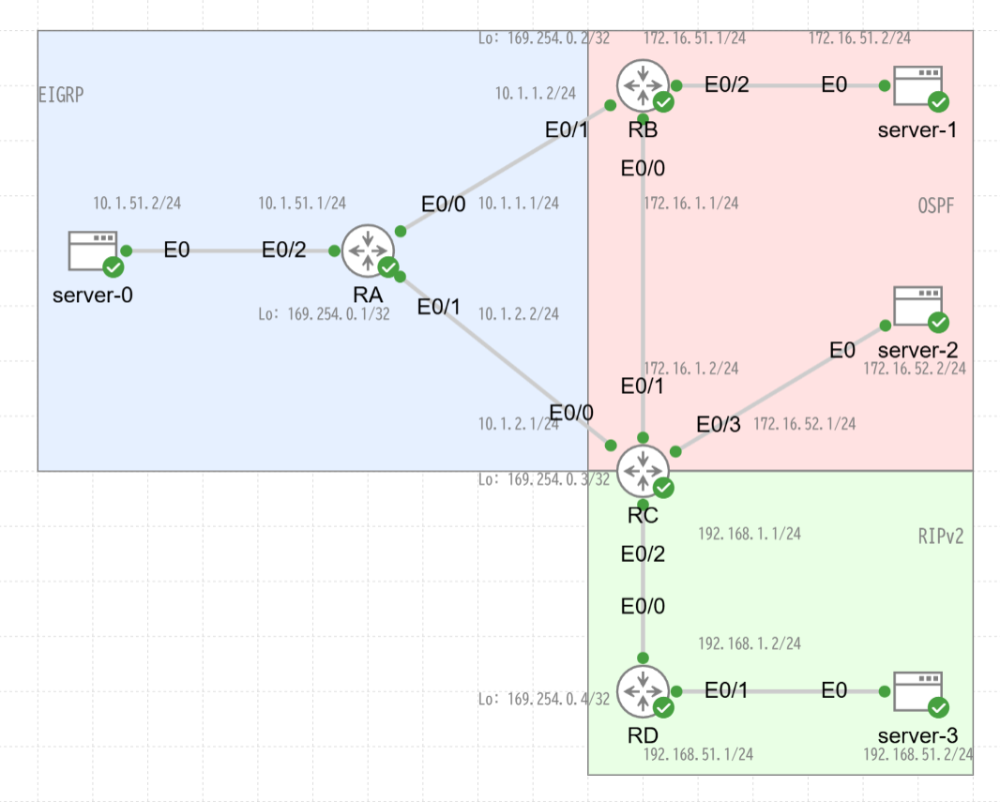

# 複数のルーターでルート再配布を行った結果ルーティングループになってしまっている構成

ping-t の問題で出て興味深かったため CML で試してみました．

## 目次

<!-- @import "[TOC]" {cmd="toc" depthFrom=2 depthTo=6 orderedList=false} -->

<!-- code_chunk_output -->

- [目次](#目次)
- [NW 構成](#nw-構成)
- [設定](#設定)
  - [RA](#ra)
  - [RB](#rb)
  - [RC](#rc)
  - [RD](#rd)
- [RC のルート情報](#rc-のルート情報)
  - [ルーティングテーブル](#ルーティングテーブル)
  - [EIGRP データベース](#eigrp-データベース)
  - [OSPF データベース](#ospf-データベース)
  - [RIP データベース](#rip-データベース)
- [対策](#対策)
  - [1. RB で 192.168.0.0/16 ルートを OSPF に再配布しないようにする](#1-rb-で-1921680016-ルートを-ospf-に再配布しないようにする)
  - [2. RC で OSPF 外部ルートの AD 値を RIP の AD 値 (120) より大きくする](#2-rc-で-ospf-外部ルートの-ad-値を-rip-の-ad-値-120-より大きくする)
- [更新履歴](#更新履歴)

<!-- /code_chunk_output -->

## NW 構成

RB で EIGRP → OSPF の再配布，RC で OSPF/RIP → EIGRP の再配布を行なっています．RC で EIGRP に最配布したルート情報が RB で OSPF に再配布されることによって RC に戻ってきてしまうことで問題が発生します．



## 設定

### RA

```cisco:RA
# IOL image version 17.16

hostname RA
ip arp proxy disable
no ip domain lookup

ip dhcp excluded-address 10.1.51.1

ip dhcp pool 10.1.51.0/24
 network 10.1.51.0 255.255.255.0
 default-router 10.1.51.1 

interface Loopback0
 ip address 169.254.0.1 255.255.255.255

interface Ethernet0/0
 ip address 10.1.1.1 255.255.255.0

interface Ethernet0/1
 ip address 10.1.2.2 255.255.255.0

interface Ethernet0/2
 ip address 10.1.51.1 255.255.255.0

router eigrp 1
 network 10.0.0.0
 passive-interface Ethernet0/2
 eigrp router-id 169.254.0.1
```

### RB

```cisco:RB
# IOL image version 17.16

hostname RB
ip arp proxy disable
no ip domain lookup

ip dhcp excluded-address 172.16.51.1

ip dhcp pool 172.16.51.0/24
 network 172.16.51.0 255.255.255.0
 default-router 172.16.51.1 

interface Loopback0
 ip address 169.254.0.2 255.255.255.255

interface Ethernet0/0
 ip address 172.16.1.1 255.255.255.0

interface Ethernet0/1
 ip address 10.1.1.2 255.255.255.0

interface Ethernet0/2
 ip address 172.16.51.1 255.255.255.0

router eigrp 1
 network 10.1.1.0 0.0.0.255
 eigrp router-id 169.254.0.2

router ospf 1
 router-id 169.254.0.2
 redistribute eigrp 1 metric-type 1
 passive-interface Ethernet0/2
 network 172.16.0.0 0.0.255.255 area 0
```

### RC

```cisco:RC
# IOL image version 17.16

hostname RC
ip arp proxy disable
no ip domain lookup

ip dhcp excluded-address 172.16.52.1

ip dhcp pool 172.16.52.0/24
 network 172.16.52.0 255.255.255.0
 default-router 172.16.52.1 

interface Loopback0
 ip address 169.254.0.3 255.255.255.255

interface Ethernet0/0
 ip address 10.1.2.1 255.255.255.0
         
interface Ethernet0/1
 ip address 172.16.1.2 255.255.255.0

interface Ethernet0/2
 ip address 192.168.1.1 255.255.255.0

interface Ethernet0/3
 ip address 172.16.52.1 255.255.255.0

router eigrp 1
 network 10.1.2.0 0.0.0.255
 redistribute ospf 1 metric 1000000 1 255 1 1500
 redistribute rip metric 1000000 1 255 1 1500
 eigrp router-id 169.254.0.3

router ospf 1
 router-id 169.254.0.3
 passive-interface Ethernet0/3
 network 172.16.0.0 0.0.255.255 area 0

router rip
 version 2
 redistribute eigrp 1 metric 1
 redistribute ospf 1 metric 1
 network 192.168.1.0
```

### RD

```cisco:RD
# IOL image version 17.16
hostname RD

ip arp proxy disable
no ip domain lookup

ip dhcp excluded-address 192.168.51.1

ip dhcp pool 192.168.51.0/24
 network 192.168.51.0 255.255.255.0
 default-router 192.168.51.1 

interface Ethernet0/0
 ip address 192.168.1.2 255.255.255.0

interface Ethernet0/1
 ip address 192.168.51.1 255.255.255.0

interface Ethernet0/2
 no ip address
 shutdown

interface Ethernet0/3
 no ip address
 shutdown

router rip
 version 2
 passive-interface Ethernet0/1
 network 192.168.1.0
 network 192.168.51.0
```

## RC のルート情報

### ルーティングテーブル

```
Gateway of last resort is not set

      10.0.0.0/8 is variably subnetted, 4 subnets, 2 masks
D        10.1.1.0/24 [90/307200] via 10.1.2.2, 22:16:50, Ethernet0/0
C        10.1.2.0/24 is directly connected, Ethernet0/0
L        10.1.2.1/32 is directly connected, Ethernet0/0
D        10.1.51.0/24 [90/307200] via 10.1.2.2, 22:16:50, Ethernet0/0
      169.254.0.0/32 is subnetted, 1 subnets
C        169.254.0.3 is directly connected, Loopback0
      172.16.0.0/16 is variably subnetted, 5 subnets, 2 masks
C        172.16.1.0/24 is directly connected, Ethernet0/1
L        172.16.1.2/32 is directly connected, Ethernet0/1
O        172.16.51.0/24 [110/20] via 172.16.1.1, 22:20:33, Ethernet0/1
C        172.16.52.0/24 is directly connected, Ethernet0/3
L        172.16.52.1/32 is directly connected, Ethernet0/3
      192.168.1.0/24 is variably subnetted, 2 subnets, 2 masks
C        192.168.1.0/24 is directly connected, Ethernet0/2
L        192.168.1.1/32 is directly connected, Ethernet0/2
O E1  192.168.51.0/24 [110/30] via 172.16.1.1, 21:12:20, Ethernet0/1
```

192.168.51.0/24 へのルートは RIP でもらった情報を使ってほしいのですが，OSPF 外部ルートの情報が乗ってしまっています．nexthop は 172.16.1.1 (RB) です．これはもともと RC → (RIP to EIGRP 再配布) → RA → RB → (EIGRP to OSPF 再配布) → RC という経路で配布されてきた情報なので，RB → RA → RC と戻ってきてしまい，ループしてしまいます．

直接の原因は AD 値です．OSPF は外部ルートであっても AD 値が 110，一方 RIP は AD 値 120 のため OSPF 外部ルートが優先されてしまいます．

### EIGRP データベース

```
RC#show ip eigrp topology 
EIGRP-IPv4 Topology Table for AS(1)/ID(169.254.0.3)
Codes: P - Passive, A - Active, U - Update, Q - Query, R - Reply,
       r - reply Status, s - sia Status 

P 172.16.51.0/24, 1 successors, FD is 2816
        via Redistributed (2816/0)
P 10.1.2.0/24, 1 successors, FD is 281600
        via Connected, Ethernet0/0
P 192.168.1.0/24, 1 successors, FD is 2816
        via Redistributed (2816/0)
P 192.168.51.0/24, 1 successors, FD is 2816
        via Redistributed (2816/0)
P 172.16.52.0/24, 1 successors, FD is 2816
        via Redistributed (2816/0)
P 172.16.1.0/24, 1 successors, FD is 2816
        via Redistributed (2816/0)
P 10.1.51.0/24, 1 successors, FD is 307200
        via 10.1.2.2 (307200/281600), Ethernet0/0
P 10.1.1.0/24, 1 successors, FD is 307200
        via 10.1.2.2 (307200/281600), Ethernet0/0
```

### OSPF データベース

```
RC#show ip ospf database 

            OSPF Router with ID (169.254.0.3) (Process ID 1)

                Router Link States (Area 0)

Link ID         ADV Router      Age         Seq#       Checksum Link count
169.254.0.2     169.254.0.2     42          0x8000003C 0x008986 2         
169.254.0.3     169.254.0.3     1736        0x80000031 0x00AC6C 2         

                Net Link States (Area 0)

Link ID         ADV Router      Age         Seq#       Checksum
172.16.1.1      169.254.0.2     293         0x8000002D 0x00C984

                Type-5 AS External Link States

Link ID         ADV Router      Age         Seq#       Checksum Tag
10.1.1.0        169.254.0.2     42          0x8000002D 0x0077C6 0         
10.1.2.0        169.254.0.2     42          0x8000002D 0x006CD0 0         
10.1.51.0       169.254.0.2     42          0x8000002D 0x004FBC 0         
192.168.1.0     169.254.0.2     42          0x80000028 0x005E86 0         
192.168.51.0    169.254.0.2     42          0x80000028 0x00367C 0         
```

### RIP データベース

```
RC#show ip rip database 
10.0.0.0/8    auto-summary
10.1.1.0/24    redistributed
    [1] via 10.1.2.2, 
10.1.2.0/24    redistributed
    [1] via 0.0.0.0, 
10.1.51.0/24    redistributed
    [1] via 10.1.2.2, 
172.16.0.0/16    auto-summary
172.16.1.0/24    redistributed
    [1] via 0.0.0.0, 
172.16.51.0/24    redistributed
    [1] via 172.16.1.1, from 169.254.0.2, 
172.16.52.0/24    redistributed
    [1] via 0.0.0.0, 
192.168.1.0/24    auto-summary
192.168.1.0/24    directly connected, Ethernet0/2
192.168.51.0/24    auto-summary
192.168.51.0/24    redistributed
    [1] via 172.16.1.1, from 169.254.0.2, 
```

## 対策

### 1. RB で 192.168.0.0/16 ルートを OSPF に再配布しないようにする

```
ip prefix-list PL_D_192.168.0.0/16 seq 10 deny 192.168.0.0/16 le 32
ip prefix-list PL_D_192.168.0.0/16 seq 100 permit 0.0.0.0/0 le 32

route-map RM_REDIST_EIGRP permit 10 
 match ip address prefix-list PL_D_192.168.0.0/16

router ospf 1
 redistribute eigrp 1 subnets metric-type 1 route-map RM_REDIST_EIGRP
```

RB に上記の通り設定を入れてしばらくすると RC のルーティングテーブルに RIP のルートが乗るようになりました．

```
Gateway of last resort is not set

      10.0.0.0/8 is variably subnetted, 4 subnets, 2 masks
D        10.1.1.0/24 [90/307200] via 10.1.2.2, 22:28:56, Ethernet0/0
C        10.1.2.0/24 is directly connected, Ethernet0/0
L        10.1.2.1/32 is directly connected, Ethernet0/0
D        10.1.51.0/24 [90/307200] via 10.1.2.2, 22:28:56, Ethernet0/0
      169.254.0.0/32 is subnetted, 1 subnets
C        169.254.0.3 is directly connected, Loopback0
      172.16.0.0/16 is variably subnetted, 5 subnets, 2 masks
C        172.16.1.0/24 is directly connected, Ethernet0/1
L        172.16.1.2/32 is directly connected, Ethernet0/1
O        172.16.51.0/24 [110/20] via 172.16.1.1, 22:32:39, Ethernet0/1
C        172.16.52.0/24 is directly connected, Ethernet0/3
L        172.16.52.1/32 is directly connected, Ethernet0/3
      192.168.1.0/24 is variably subnetted, 2 subnets, 2 masks
C        192.168.1.0/24 is directly connected, Ethernet0/2
L        192.168.1.1/32 is directly connected, Ethernet0/2
R     192.168.51.0/24 [120/1] via 192.168.1.2, 00:00:10, Ethernet0/2
```

### 2. RC で OSPF 外部ルートの AD 値を RIP の AD 値 (120) より大きくする

```
router ospf 1
 distance ospf external 130
```

RC に上記の通り設定を入れてしばらくすると RC のルーティングテーブルに RIP のルートが乗るようになりました．

```
Gateway of last resort is not set

      10.0.0.0/8 is variably subnetted, 4 subnets, 2 masks
D        10.1.1.0/24 [90/307200] via 10.1.2.2, 22:46:29, Ethernet0/0
C        10.1.2.0/24 is directly connected, Ethernet0/0
L        10.1.2.1/32 is directly connected, Ethernet0/0
D        10.1.51.0/24 [90/307200] via 10.1.2.2, 22:46:29, Ethernet0/0
      169.254.0.0/32 is subnetted, 1 subnets
C        169.254.0.3 is directly connected, Loopback0
      172.16.0.0/16 is variably subnetted, 5 subnets, 2 masks
C        172.16.1.0/24 is directly connected, Ethernet0/1
L        172.16.1.2/32 is directly connected, Ethernet0/1
O        172.16.51.0/24 [110/20] via 172.16.1.1, 00:03:12, Ethernet0/1
C        172.16.52.0/24 is directly connected, Ethernet0/3
L        172.16.52.1/32 is directly connected, Ethernet0/3
      192.168.1.0/24 is variably subnetted, 2 subnets, 2 masks
C        192.168.1.0/24 is directly connected, Ethernet0/2
L        192.168.1.1/32 is directly connected, Ethernet0/2
R     192.168.51.0/24 [120/1] via 192.168.1.2, 00:00:04, Ethernet0/2
```

## 更新履歴

- 2025-11-09
  * 初版