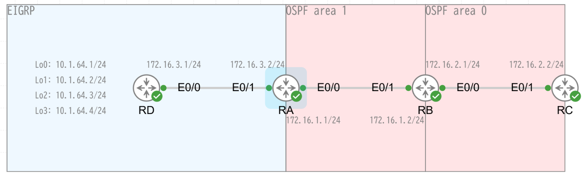

# EIGRP と OSPF の相互再配布検証

## 目次

<!-- @import "[TOC]" {cmd="toc" depthFrom=2 depthTo=6 orderedList=false} -->

<!-- code_chunk_output -->

- [目次](#目次)
- [NW 構成](#nw-構成)
- [設定](#設定)
  - [RA](#ra)
  - [RB](#rb)
  - [RC](#rc)
  - [RD](#rd)
- [更新履歴](#更新履歴)

<!-- /code_chunk_output -->

## NW 構成

## 設定

### RA

### RB

### RC

### RD

## 更新履歴
