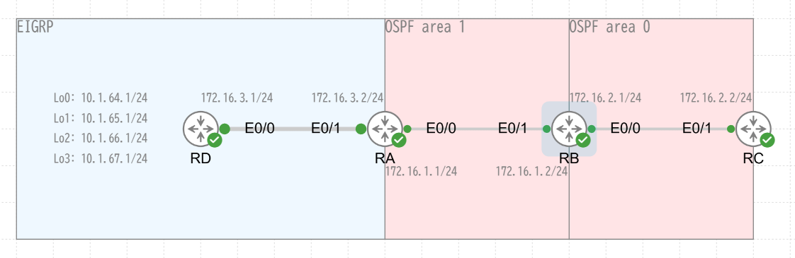

# EIGRP と OSPF の相互再配布検証

## 目次

<!-- @import "[TOC]" {cmd="toc" depthFrom=2 depthTo=6 orderedList=false} -->

<!-- code_chunk_output -->

- [目次](#目次)
- [NW 構成](#nw-構成)
- [設定](#設定)
  - [RD](#rd)
  - [RA](#ra)
  - [RB](#rb)
  - [RC](#rc)
  - [確認](#確認)
- [更新履歴](#更新履歴)

<!-- /code_chunk_output -->

## NW 構成



## 設定

- RD ～ RA は EIGRP
- RA ～ RB ～ RC は OSPF
- RA は ASBR
- RB は ABR

### RD

```
# IOL image version 17.16

hostname RD
ip arp proxy disable
no ip domain lookup

interface Loopback0
 ip address 10.1.64.1 255.255.255.0

interface Loopback1
 ip address 10.1.65.1 255.255.255.0

interface Loopback2
 ip address 10.1.66.1 255.255.255.0

interface Loopback3
 ip address 10.1.67.1 255.255.255.0

interface Ethernet0/0
 ip address 172.16.3.1 255.255.255.0

router eigrp 1
 network 10.1.64.0 0.0.3.255
 network 172.16.3.0 0.0.0.255
 eigrp router-id 169.254.0.4
```

### RA

```
# IOL image version 17.16

hostname RA
ip arp proxy disable
no ip domain lookup

interface Ethernet0/0
 ip address 172.16.1.1 255.255.255.0

interface Ethernet0/1
 ip address 172.16.3.2 255.255.255.0

router eigrp 1
 network 172.16.3.0 0.0.0.255
 redistribute ospf 1 metric 1000000 1 255 1 1500 route-map RM_REDIST_TO_EIGRP
 eigrp router-id 169.254.0.1

router ospf 1
 router-id 169.254.0.1
 summary-address 10.1.64.0 255.255.252.0
 redistribute eigrp 1 metric-type 1 route-map RM_REDIST_TO_OSPF
 network 172.16.1.0 0.0.0.255 area 1

ip prefix-list PL_REDIST_TO_EIGRP seq 10 permit 172.16.1.0/24
ip prefix-list PL_REDIST_TO_EIGRP seq 20 permit 172.16.2.0/24

ip prefix-list PL_REDIST_TO_OSPF seq 10 permit 10.1.64.0/22 le 24
ip prefix-list PL_REDIST_TO_OSPF seq 20 permit 172.16.3.0/24

route-map RM_REDIST_TO_OSPF deny 10 
 match tag 100

route-map RM_REDIST_TO_OSPF permit 20 
 match ip address prefix-list PL_REDIST_TO_OSPF
 set tag 100

route-map RM_REDIST_TO_EIGRP deny 10 
 match tag 100

route-map RM_REDIST_TO_EIGRP permit 20 
 match ip address prefix-list PL_REDIST_TO_EIGRP
 set tag 100
```

### RB

```
# IOL image version 17.16

hostname RB
ip arp proxy disable
no ip domain lookup

interface Ethernet0/0
 ip address 172.16.2.1 255.255.255.0

interface Ethernet0/1
 ip address 172.16.1.2 255.255.255.0

router ospf 1
 router-id 169.254.0.2
 network 172.16.1.0 0.0.0.255 area 1
 network 172.16.2.0 0.0.0.255 area 0
```

### RC

```
# IOL image version 17.16

hostname RC
ip arp proxy disable
no ip domain lookup

interface Ethernet0/1
 ip address 172.16.2.2 255.255.255.0

router ospf 1
 router-id 169.254.0.3
 network 172.16.2.0 0.0.0.255 area 0
```

### 確認

```
RA# show ip route

      10.0.0.0/8 is variably subnetted, 5 subnets, 2 masks
O        10.1.64.0/22 is a summary, 08:18:51, Null0
D        10.1.64.0/24 [90/409600] via 172.16.3.1, 08:18:59, Ethernet0/1
D        10.1.65.0/24 [90/409600] via 172.16.3.1, 08:18:59, Ethernet0/1
D        10.1.66.0/24 [90/409600] via 172.16.3.1, 08:18:59, Ethernet0/1
D        10.1.67.0/24 [90/409600] via 172.16.3.1, 08:18:59, Ethernet0/1
      172.16.0.0/16 is variably subnetted, 5 subnets, 2 masks
C        172.16.1.0/24 is directly connected, Ethernet0/0
L        172.16.1.1/32 is directly connected, Ethernet0/0
O IA     172.16.2.0/24 [110/20] via 172.16.1.2, 08:18:25, Ethernet0/0
C        172.16.3.0/24 is directly connected, Ethernet0/1
L        172.16.3.2/32 is directly connected, Ethernet0/1
```

- EIGRP によって RD の loopback I/F へのルートを得ている
- 10.1.64.0/22 への Null0 ルートが自動登録されている．ルーティングループを防ぐための措置？
- OSPF area 0 へのルートは `O IA` として登録されている

```
RB# show ip route

      10.0.0.0/22 is subnetted, 1 subnets
O E1     10.1.64.0 [110/30] via 172.16.1.1, 08:34:36, Ethernet0/1
      172.16.0.0/16 is variably subnetted, 5 subnets, 2 masks
C        172.16.1.0/24 is directly connected, Ethernet0/1
L        172.16.1.2/32 is directly connected, Ethernet0/1
C        172.16.2.0/24 is directly connected, Ethernet0/0
L        172.16.2.1/32 is directly connected, Ethernet0/0
O E1     172.16.3.0/24 [110/30] via 172.16.1.1, 08:34:36, Ethernet0/1
```

- 集約済みの 10.1.64.0/22 が OSPF 外部ルートとして得られている

## 更新履歴

- 2025-11-24
  * 初版
